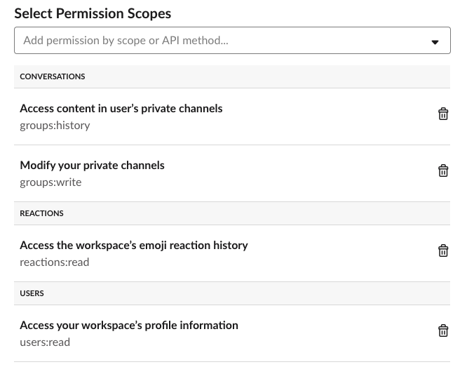

Quickstart
==========


Django configuration
--------------------

Requires Django >= 2.0 and PostgreSQL >= 9.4.

1. Install django-slackchat-serializer using pip.

  ::

    $ pip install django-slackchat-serializer

2. Add slackchat-serializer to your installed apps and create the minimum required token configuration to interact with Slack.

  .. code-block:: python

    # project/settings.py

    INSTALLED_APPS = [
        # ...
        'rest_framework',
        'foreignform',
        'slackchat',
    ]

    SLACKCHAT_SLACK_VERIFICATION_TOKEN = os.getenv('SLACK_VERIFICATION_TOKEN')
    SLACKCHAT_SLACK_API_TOKEN = os.getenv('SLACK_API_TOKEN')

3. Add slackchat to your project's :code:`urls.py`.

  .. code-block:: python

    # project/urls.py

    urlpatterns = [
      # ...
      path('slackchat/', include('slackchat.urls')),
    ]


4. Slackchat uses `Celery <http://docs.celeryproject.org/en/latest/getting-started/introduction.html>`_ to process some tasks asynchronously. Read `"First steps with Django" <http://docs.celeryproject.org/en/latest/django/first-steps-with-django.html>`_ to see how to setup a Celery app in your project. Here is a configuration you can also use to start:

  .. code-block:: python

    # project/celery.py
    import os

    from celery import Celery
    from django.conf import settings

    os.environ.setdefault('DJANGO_SETTINGS_MODULE', '<your project>.settings')

    app = Celery('slackchat')
    app.config_from_object('django.conf:settings', namespace='CELERY')
    app.conf.update(
      task_serializer='json'
    )
    # Use synchronous tasks in local dev
    if settings.DEBUG:
      app.conf.update(task_always_eager=True)
    app.autodiscover_tasks(lambda: settings.INSTALLED_APPS, related_name='celery')

  .. code-block:: python

    # project/__init__.py
    from .celery import app as celery_app

    __all__ = ['celery_app']

5. Run migrations.

  ::

    $ python manage.py migrate slackchat

Slack configuration
--------------------


1. Create `a new app <https://api.slack.com/slack-apps>`_ for your team in Slack.

2. Grab your app's `verification token <https://api.slack.com/docs/token-types#verification_tokens>`_ (for :code:`SLACKCHAT_SLACK_VERIFICATION_TOKEN`).

  .. image:: ./images/verification.png
    :width: 500px

3. From the **OAuth & Permissions** section, get your app's `OAuth Access Token <https://api.slack.com/docs/token-types#user>`_ (for :code:`SLACKCHAT_SLACK_API_TOKEN`).

  .. image:: ./images/api-token.png
    :width: 500px

4. Add these permission scopes: :code:`groups:history`, :code:`groups:write`, :code:`reactions:read`, :code:`users:read`.



5. Enable `events subscriptions <https://api.slack.com/events-api>`_ in your app and configure the Request URL to hit slackchat-serializer's events endpoint. (Slackchat will automatically verify the URL with Slack.)

  .. image:: ./images/events.png
    :width: 500px

6. Subscribe to these workspace events: :code:`message.groups`, :code:`reaction_added` and :code:`reaction_removed`.

  .. image:: ./images/workspace-events.png
    :width: 500px


First slackchat
---------------

1. Run a management command to seed your app with Slack users:

  ```
  $ python manage.py get_slackchat_users
  ```

2. Log into the Django admin.

3. Create a new :code:`ChatType` instance.

4. Create a new :code:`Channel` instance, which will create a new private channel in Slack to host your slackchat.

5. Invite any other members you want to the group and start chatting!

Configuring locally
-------------------

If you're just trying out slackchat-serializer locally, we recommend using `ngrok <https://ngrok.com/>`_ to proxy Django's own development server to a public URL that Slack can hit with event messages.

If you're running your development server on port 8000, for example, you can start an ngrok tunnel like this:

::

  $ ngrok http 8000

Now grab the tunnel's :code:`https` URL and use it to configure the request URL in your Slack app's event subscriptions.

Developing
----------

Move into the example directory and start a pipenv shell.

::

  $ pipenv shell


You can now develop using Django's development server.
