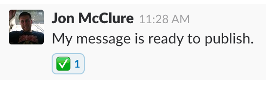
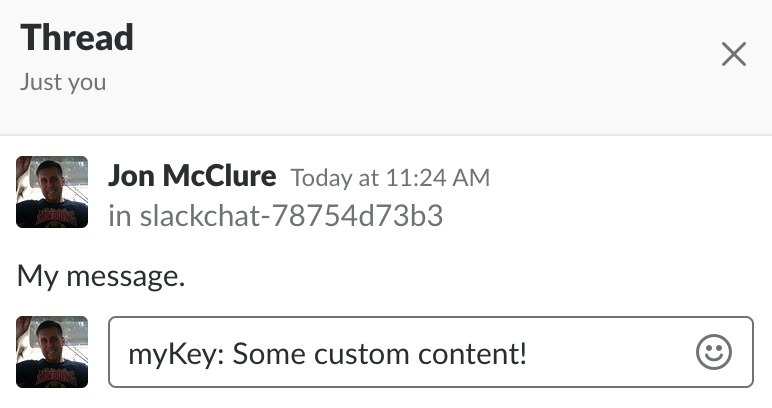

betweenSerialization
=============

Channel
-------

Slackchat-serializer includes a RESTful API with a single endpoint used to serialize a channel and all its messages, reactions and users.

You can access the serialized representation for any channel at:

:code:`{slackchat URL}/api/channels/{channel ID}/`

Here's an example of a serialized channel:

.. code-block:: json

  {
    "id": "XXXXXXXX-XXXX-XXXX-XXXX-XXXXXXXXXXXX",
    "api_id": "GXXXXXXXX",
    "chat_type": "basic",
    "title": "Our first Slackchat!",
    "introduction": "Welcome to our first Slackchat. \nFollow along below:",
    "meta": {
        "title": "First Slackchat",
        "description": "Live blogging.",
        "image": "http://mysite.com/share-image.jpg"
    },
    "extras": {
      "video": "https://www.youtube.com/watch?v=V7uEb_XrK1U"
    },
    "paths": {
        "channel": "/2018-01-01/some-chat/",
        "chat_type": "/slackchats/"
    },
    "publish_path": "/slackchats/2018-01-01/some-chat/",
    "publish_time": "2018-01-01T01:30:00Z",
    "live": true,
    "users": {
        "U4XV32XKR": {
            "first_name": "Jon",
            "last_name": "McClure",
            "image": "slackchat/users/JonMcClure/profile-7f37ceefad.jpg",
            "title": "Interactive news editor"
        }
    },
    "messages": [
        {
            "timestamp": "2018-02-04T15:00:45.000065Z",
            "user": "U4XV32XKR",
            "content": "Hi, welcome to our **first** *Slackchat*!",
            "attachments": [
              {
                  "image_url": "https://myserver.com/some-image.jpg",
                  "image_width": 400,
                  "image_height": 400
              }
            ],
            "args": ["edited"],
            "kwargs": {
              "style": "moderator-styles"
            }
        },
        {
            "timestamp": "2018-02-04T15:10:09.000129Z",
            "user": "U4XV32XKR",
            "content": "Check out this [link](http://www.google.com).",
            "reactions": [
              {
                "timestamp": "2018-02-04T19:21:29.000085Z",
                "reaction": "fire",
                "user": "U4XV32XKR"
              },
            ],
        }
    ],
    "timestamp": "2018-01-01T23:46:26.321994Z"
  }

chat_type
^^^^^^^^^

Slackchats are serialized with a chat_type property, which represents a :code:`ChatType` instance.

This is useful to identify a particular template your renderer may use to render different types of slackchats, for example, using different design treatments or branding.

Custom `args & kwargs`_ patterns are also configured per :code:`ChatType`.

meta
^^^^

Use meta attributes to fill out social meta tags in your renderer.

extras
^^^^^^

You can configure additional fields per ChatType to collect specialized data for a channel. Say you have a ChatType that includes a live video feed. You can configure a field to collect a video embed code for this template, and the value for that field will be serialized here.

.. note::

  Configure additional fields in the :code:`ChatType` admin using a JSON Schema and UI Schema. Users will then see the additional fields in the :code:`Channel` admin. See `django-foreignform <https://github.com/The-Politico/django-foreignform>`_ for more information on using this feature.

messages
^^^^^^^^

Messages are rendered in Markdown syntax by default, unless :code:`render_to_html = True` on the :code:`ChatType` instance, in which case the message is rendered from Markdown into HTML when serializing.

See the `markslack <https://github.com/The-Politico/markslack>`_ package and :ref:`config-options` for more information on how your users can format links, images, user mentions and text in Slack messages.

reactions
^^^^^^^^^

Reactions are captured with the emoji code of the reaction, for example, :code:`fire` for `🔥`.

We recommend using the `emoji <https://pypi.python.org/pypi/emoji/>`_ package to translate reaction emoji codes to true unicode symbols in your renderer, which is what `markslack <https://github.com/The-Politico/markslack#emoji>`_ uses when converting messages from Slack.

attachments
^^^^^^^^^^^

Attachments are links or images Slack has "unfurled" in a message. They contain metadata about a link or media item that allows you to render it in a richer way.

See `Slack <https://api.slack.com/docs/message-link-unfurling#classic_unfurling>`_ for more information.

args & kwargs
^^^^^^^^^^^^^

With each message you can serialize custom data, which can signal some special handling to your renderer.

Slackchat-serializer lets you construct that data like the arguments and keyword arguments you'd pass to a function. Configure them using the :code:`Argument` and :code:`KeywordArgument` models and then consume them in your renderer.

These features can be used to represent important workflow steps or to add custom metadata to messages.

args
~~~~

Args are most often created through emoji reactions in Slack.

For example, say you want the :code:`:white_check_mark:` ( ✅ ) reaction to signal to your renderer that a message has been copyedited.

You can create an :code:`Argument` object associated with that character -- e.g., :code:`'white_check_mark'` -- with a custom argument name -- e.g., :code:`'edited'` -- that will be serialized with any message with that emoji reaction.

.. code-block:: json

  "messages": [
        {
            "timestamp": "2018-02-04T15:00:45.000065Z",
            "user": "SOMEUSER1",
            "content": "My message is ready to publish.",
            "args": ["edited"]
        },
    ]

You can also use a :code:`CustomContentTemplate` instance to attach an arg to a message whenever the instance's :code:`search_string` matches the content of a message.

kwargs
~~~~~~

Kwargs are created by messages in a thread attached to a Slack message.

Create your threaded message with a key: value pair:

That pair will be parsed and serialized as kwargs on the message:

.. code-block:: json

  "messages": [
        {
            "timestamp": "2018-02-04T15:00:45.000065Z",
            "user": "SOMEUSER1",
            "content": "My message.",
            "kwargs": {
              "myKey": "Some custom content!"
            }
        },
    ]

One common use case for kwargs is to tag messages for use in custom navigation in the rendered slackchat.

.. note::

  You can turn off kwarg handling for a :code:`ChatType` by setting :code:`kwargs_in_threads = False`.

Custom content templates
^^^^^^^^^^^^^^^^^^^^^^^^

You can use a :code:`CustomContentTemplate` to change the way messages' content is serialized or to add a custom arg to a message.

Set a regex :code:`search_string` to match against messages' content and capture groups of any content you want to reformat. Then use one of the template features to customize your message.

Content
~~~~~~~

Add a :code:`content_template` Python formatting string that will reformat content. Leaving this field blank will pass the entire message's contents through.

For example, you might set up a :code:`CustomContentTemplate` instance like this:

.. code-block:: python

  # regex search string
  template.search_string =  '^ALERT! (.*)'

  # formatting string
  template.content_template = '{0}'

Now a message from Slack like this:

::

  ALERT! New slackchat started!

... would be reformated in the serializer like this:

::

  New slackchat started!

Args
~~~~

You can also add an :code:`argument_template` to your template instance, which will place arguments in the matched message's :code:`args` when serialized These arguments should be comma-separated and can be regular text or a Python formatted strings whose args are the capture groups matched by the search string.

For example ...

.. code-block:: python

  # Message: ALERT red! New slackchat started!

  # regex search string
  template.search_string =  '^ALERT (.*)! (.*)'

  # formatting string
  template.content_template = '{1}'

  # argument template
  template.argument_template = 'alert, alert-{0}'

... would render like this in the serializer of a matched message:

.. code-block:: json

  "messages": [
        {
            "timestamp": "2018-02-04T15:00:45.000065Z",
            "user": "SOMEUSER1",
            "content": "New slackchat started!",
            "args": ["alert", "alert-red"]
        },
    ]

Attachment
~~~~~~~~~~

A custom attachment can be added to your message using a JSON object schema. The values of the object can be Python formatted strings once again passed the args of the capture group.

When creating a custom attachment you might consider consulting `Slack's attachment documentation <https://api.slack.com/docs/message-attachments>`_ to keep some sense of consistency between Slack-generated attachments and your custom one.

For example ...

.. code-block:: python

  # Message: ALERT red! New slackchat started!

  # regex search string
  template.search_string =  '^ALERT (.*)! (.*)'

  # formatting string
  template.content_template = '{1}'

  # attachment template
  template.attachment_template = {
        "title": "Alert!",
        "service" "Alerter"
        "title_link": "http://example.com/alert",
        "text": "{0}",
        "color": "#ff0000"
    }

... would render like this in the serializer of a matched message:

.. code-block:: json

  "messages": [
        {
            "timestamp": "2018-02-04T15:00:45.000065Z",
            "user": "SOMEUSER1",
            "content": "New slackchat started!",
            "attachments": [
                {
                    "title": "Alert!",
                    "service" "Alerter"
                    "title_link": "http://example.com/alert",
                    "text": "red",
                    "color": "#ff0000"
                }
            ]
        },
    ]

Kwargs
~~~~~~

Custom kwargs are also available using a JSON object schema. The values of the object can be Python formatted strings once again passed the args of the capture group. If there are duplicate-key conflicts between these and kwargs added via message threads, the message threads will take precedence.

For example ...

.. code-block:: python

  # Message: ALERT red! New slackchat started!

  # regex search string
  template.search_string =  '^ALERT (.*)! (.*)'

  # formatting string
  template.content_template = '{1}'

  # kwarg template
  template.kwarg_template = {
    'alert-type': '{0}'
  }

... would render like this in the serializer of a matched message:

.. code-block:: json

  "messages": [
        {
            "timestamp": "2018-02-04T15:00:45.000065Z",
            "user": "SOMEUSER1",
            "content": "New slackchat started!",
            "kwargs": {
              "alert-type": "red"
            }
        },
    ]

It's up to you to make sure your regex search strings aren't too greedy.
